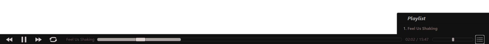
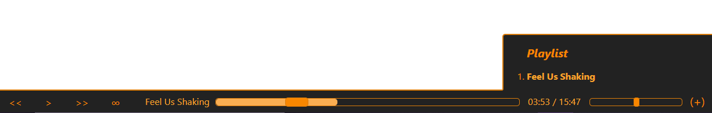

# Theme List

[Back to Readme](../../..)

Some of these themes are works in progress and any modifications or suggestions are more than welcome.

## Default

This theme is the default, and will be used if no other styling is applied.

## Dark

A dark theme with subtle warm tones threaded throughout.

[Theme CSS](./dark/dark.css)

## Golden

A dim, soft gold theme.

[Theme CSS](./golden/golden.css)

## Code

A theme with text button labels in a warm amber.

[Theme CSS](./code/code.css)
